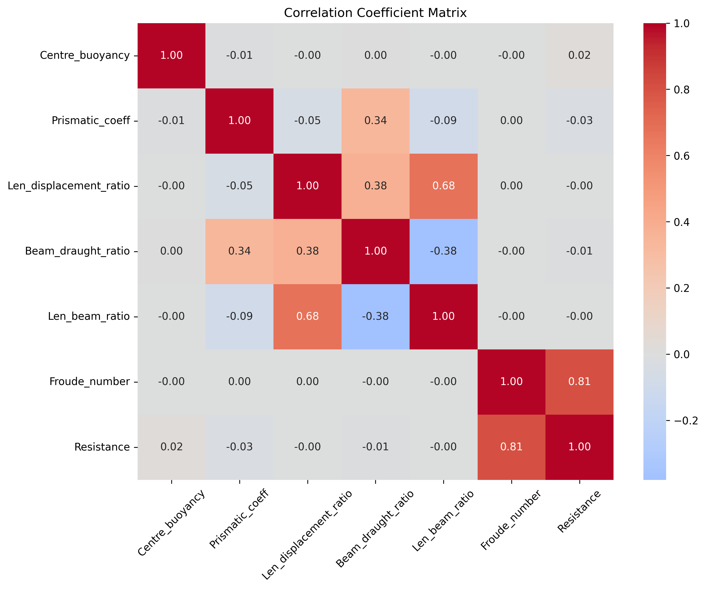
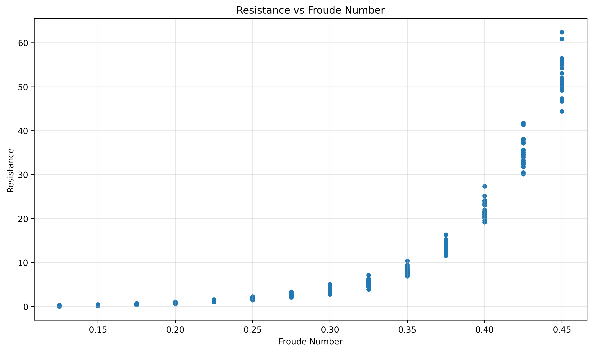
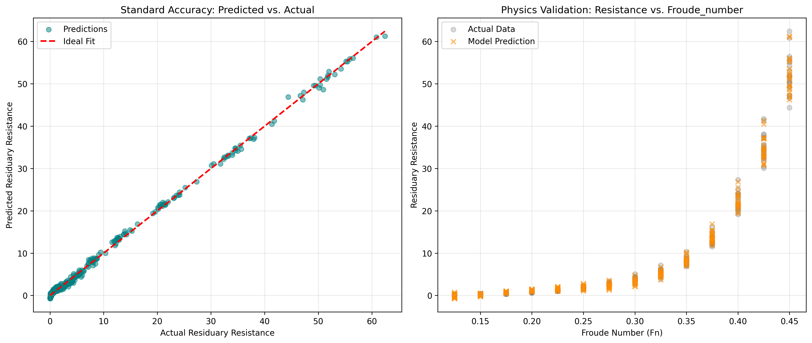
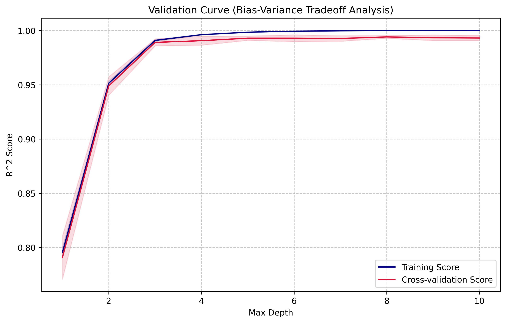
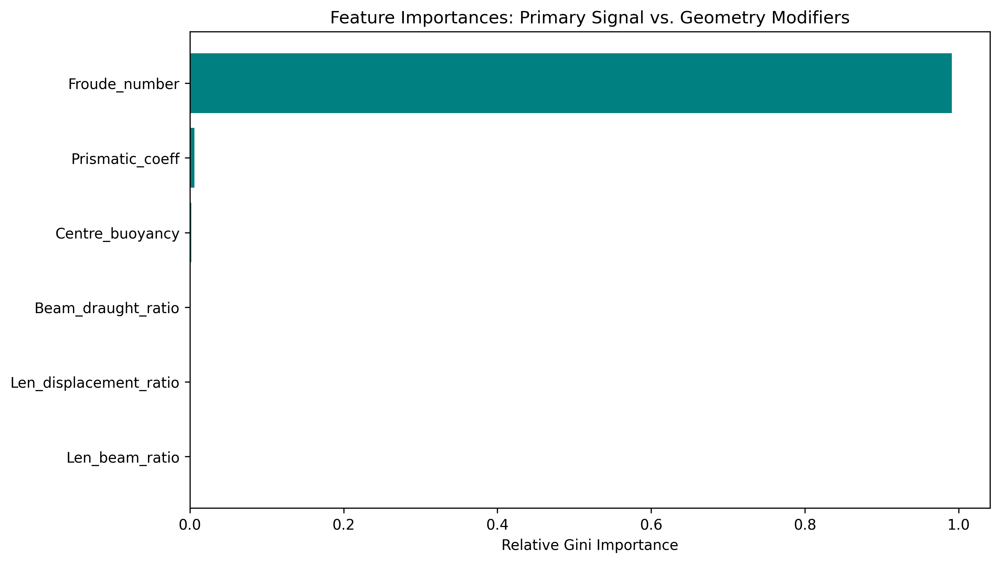
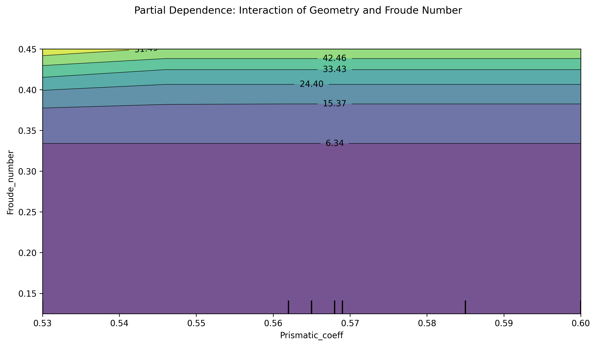

# ⛵ Predicting Yacht Hydrodynamic Resistance: A Machine Learning Approach

[](https://www.python.org/downloads/)
[](https://scikit-learn.org/)

## 🌊 The Physics Problem
Estimating the residuary resistance of sailing yachts is a complex fluid dynamics problem. As a yacht accelerates, it transitions from a **displacement regime** (where skin friction dominates) to a **planing regime** (where wave-making resistance dominates). 

This transition, typically occurring around a **Froude Number (Fr) of 0.3 to 0.4**, causes a highly non-linear "wall" of resistance. The goal of this project is to accurately model this physical behaviour using machine learning, preserving engineering interpretability rather than just chasing a high $R^2$ score.

---

## 📊 The Dataset
The data used in this project is the **[Yacht Hydrodynamics Data Set](https://www.kaggle.com/datasets/heitornunes/yacht-hydrodynamics-data-set/data)**, sourced from Kaggle (originally generated from the Delft Systematic Yacht Hull Series). 

The dataset consists of 308 full-scale experiments and predicts residuary resistance based on a combination of hull geometry and hydrodynamic input variables:
1. **Longitudinal Centre of Buoyancy** (Hull Geometry)
2. **Prismatic Coefficient** (Hull Geometry)
3. **Length-Displacement Ratio** (Hull Geometry)
4. **Beam-Draught Ratio** (Hull Geometry)
5. **Length-Beam Ratio** (Hull Geometry)
6. **Froude Number** (Hydrodynamic Signal)

**Target Variable:** Residuary Resistance (per unit weight of displacement).

---

## 📖 Project Narrative & Methodology

This project is broken into three sequential stages, illustrating the journey from raw data to an interpretable, production-ready model.

### Part 1: Exploratory Data Analysis (`01_eda_yacht_hydro.py`)
Initial linear analysis presents a deceptive picture of the hydrodynamics. Looking at the **Correlation Matrix** and **Geometry Sensitivity** charts below, standard linear metrics suggest that the Froude Number is the *only* variable that matters (Pearson correlation of 0.81), while hull geometry modifiers appear entirely irrelevant (correlations near 0.00).

<p align="center">
  
  
</p>

However, visualising the data reveals why linear metrics fail. The **Scatter Plot** below exposes the fundamental challenge of this dataset. Resistance sits near zero until Fr ≈ 0.3, at which point it spikes exponentially. 

More importantly, look at the vertical spread of the data at Fr > 0.4. That massive variance is caused by hull geometry. Geometry *does* matter, but only as a conditional modifier at high speeds: **a relationship not captured by single-value linear correlation**.


*(Note: Resistance vs. Froude Number showing the wave-making resistance wall and high-speed variance)*

### Part 2: A Purely Mathematical Approach (`02_poly_ridge_yacht_hydro.py`)
To capture the non-linear spike identified in the EDA, the first predictive model utilised **Polynomial Ridge Regression (PRR)**. A pipeline was built using `PolynomialFeatures` and `GridSearchCV` to tune regularisation. 

Looking at the validation plots below, the model appears to be a massive success. It achieves a near-perfect fit (left) and beautifully captures both the exponential wall and the geometry-induced variance at high Froude numbers (right).


*(Note: Polynomial Ridge Regression performance. Highly accurate, but mathematically abstracted.)*

However, while this model achieved an excellent $R^2$ score, it failed the "Engineering Interpretability" test. Extracting the model's coefficients revealed an uninterpretable soup of high-degree interactions:
```text
Top Interactions (Physical Modifiers):
Froude_number^4                                      172.93
Beam_draught_ratio^2 * Froude_number^2                30.23
Prismatic_coeff * Beam_draught_ratio * Froude_number  29.64
```
In engineering, if a model relies heavily on a massive $Fr^4$ coefficient to force a curve to fit, it is acting as a mathematical black-box. It memorised the curve rather than capturing true, explainable hydrodynamic interactions. 

### Part 3: A Physics-Based Approach (`03_dtree_yacht_hydro.py`)
To regain interpretability without sacrificing accuracy, the final architecture relies on an object-oriented **Decision Tree Regressor** pipeline. Tree-based models are inherently suited to this problem because they construct threshold-based logic (e.g., `IF Fr > 0.3 THEN ...`), perfectly mimicking the physical "regime shift" of the hull.

#### Hyperparameter Tuning & Performance
By plotting the Bias-Variance tradeoff, we identified that a `max_depth` of 5 provides the optimal balance. Beyond depth 5, the model gains no meaningful cross-validation accuracy and begins to risk over-fitting. 
Using this parameter, the model achieves an outstanding **Cross-Validation $R^2$ Score of 0.993 (± 0.002)**.



#### Extracting the Physics
Unlike the polynomial model, the Decision Tree allows us to isolate the exact drivers of resistance. The feature importance plot confirms that the Froude Number acts as the primary signal, but it uniquely isolates the **Prismatic Coefficient** as the most important secondary geometry modifier.



Finally, generating a 2D Partial Dependence plot for Froude Number vs. Prismatic Coefficient provides the ultimate validation of our engineering hypothesis:
* Look at the lower half of the plot (Fr < 0.35): The contour lines are completely horizontal. This mathematically proves that at low speeds, hull geometry has almost zero impact on residuary resistance. 
* Look at the top of the plot (Fr > 0.40): The contours shift vertically, demonstrating that as the yacht enters the wave-making regime, the Prismatic Coefficient actively modifies the total resistance.


*(Note: Decision Tree Partial Dependence plot validating that geometry alters resistance exclusively in the high Froude Number regime)*

---

## 📁 Repository Structure
* `01_eda_yacht_hydro.py`: Baseline data investigation exposing the failure of linear correlation.
* `02_poly_ridge_yacht_hydro.py`: Polynomial pipeline proving high accuracy but low interpretability.
* `03_dtree_yacht_hydro.py`: Final object-oriented Decision Tree architecture.
* `helperfnc.py`: Data loading and preprocessing utilities.
* `yacht_hydro.csv`: The primary dataset.
* `/assets`: Saved visualisations for this README.

## 🚀 Quick Start
To run the models and generate the plots locally:
```bash
git clone https://github.com/yourusername/yacht-hydro-prediction.git
cd yacht-hydro-prediction
pip install -r requirements.txt

# Run the pipeline sequentially
python 01_eda_yacht_hydro.py
python 02_poly_ridge_yacht_hydro.py
python 03_dtree_yacht_hydro.py
```